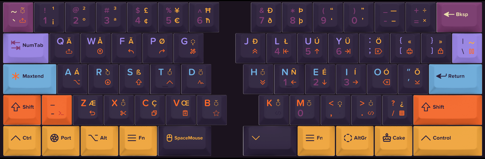

# maxtend
Extended keyboard layers for easy navigation and functionality from a Colemak base layout.
(Possibly can be applied to other base layouts, too).

This repository contains various configurations and tooling to create an extended keyboard setup for both Windows and Linux, and a matching configuration for the [Ultimate Hacking Keyboard](https://ultimatehackingkeyboard.com). The configurations start from a Colemak base layout, but the concepts behind the navigation and numpad layers also work with other base layouts.

Read more about the [Background](BACKGROUND.md) of this setup.

## Main features of this layout
- a navigation layer (called *maxtend*) for cursor movement, text selection and cut/copy/paste
- a numpad layer (called *numtab*) for entering numbers in forms, sheets, calculators
- mouse support (on systems that support it) for clicking and scrolling

## Documentation
[Full description of layers and functionality](documentation/documentation.md)

The configuration is setup in three stages:
1. base OS setup - giving a standard Colemak layout without extended functionality
2. maxtend layer - giving extended functionality such as navigation, mouse scrolling etc.;  
   (achieved via AutoHotKey (Windows), keyd (Linux), or xkb (Linux, deprecated))
4. external keyboard - giving extended functionality even if your host computer does not have `maxtend` installed, and extends it further

These stages can work independently, but also combine on top of each other for best functionality.

## Installation
Depending on your OS and preferred setup, find the configuration for each of the different tools in the corresponding subdirectories. 
- For Windows, pick the [ahk](ahk/) configuration (and load via [AutoHotKey](https://www.autohotkey.com/)).
- For Linux, choose between either [xkb](xkb/) ([how to configure](xkb/HOWTO), deprecated) or [keyd](keyd/) (recommended, using [the keyd service](https://github.com/rvaiya/keyd)).
- Check out [uhk](uhk/) for a matching configuration for the [Ultimate Hacking Keyboard](https://ultimatehackingkeyboard.com) (an external programmable keyboard).

## Credits & Inspiration
- [The inventor of Colemak, shai coleman](https://colemak.com).
- [DreymaR and his Big Bag of Keyboard Tricks](https://dreymar.colemak.org/).
