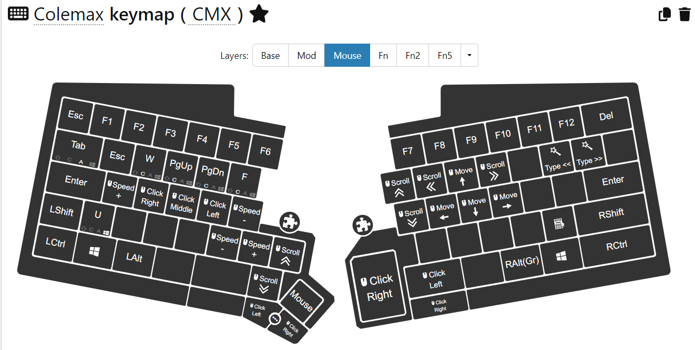

# Maxtend User Documentation

## Overview


*Maxtend* is designed to minimise hand movements and enable keyboard operations mostly from the home row hand positions. It is optimised for 60% keyboards (no number pad, no navigation cluster, no function row), but works equally well on TKL[^tkl] or full-size keyboards. *Maxtend* uses layers for the functionality traditionally bound to specific keys (cursor navigation, editing, number entry, function keys etc.), which are not present on a 60% keyboard.

- A short press and release of CapsLock (labelled `Maxtend`) will work as Backspace, as in original Colemak.
- Holding CapsLock (`Maxtend`) together with other keys works as an additional function layer, and contains useful navigation functions, e.g. cursor movement.
- Holding Tab (`Numtab`) enables a virtual number pad, allowing easy number entry.

On a UHK[^uhk], additional functionality is available, e.g. mouse control, 2-axis scrolling, mouse jitter keep-alive, media and volume control.

### Notation conventions

- `a` a key producing the letter 'a' (unshifted) and 'A' (shifted)
- `[{` a key producing the symbols '[' (unshifted) and '{' (shifted)
- `Shift`+`a` two keys pressed together (`Shift` held down first, then `a`)
- *Maxtend* an emphasis
- **Escape** a different emphasis
- ***`LED`*** (bold, italics, upper case) something displayed on the UHK LED display
- ***`mod`*** (bold, italics, lower case) an indicator on the UHK LED display

### Base layer

A maxtended keyboard features a base layer in [Colemak](https://colemak.com/) layout.

```text
Colemak base layer:
`~    1!   2@   3#   4$   5%   6^   7&   8*   9(   0)   -_   =+  Bkspc
Numtab  q    w    f    p    g    j    l    u    y    ;:   [{   ]}   \|
Maxtend  a    r    s    t    d    h    n    e    i    o    '"   Return
Shift      z    x    c    v    b    k    m    ,<   .>   /?       Shift
```

The base [Colemak](https://colemak.com/) layout has a number of alphabet characters on different keys than the well-known US-QWERTY layout, but all the special characters (symbols, punctuation, brackets, parenthesis etc.) are on the same positions as US-QWERTY (the only exception being `;:`). In addition, it features a comprehensive set of [international multilingual characters](https://colemak.com/Multilingual) (for latin alphabets) through use of the `AltGr` (right alt) key.

As in standard Colemak, the `CapsLock` key is used as Backspace. On *Maxtend*, it is labeled `Maxtend`. A simple tap on `Maxtend` produces a backspace, erasing the character to the left of the cursor. See below for layer switching when `Maxtend` is held down.

#### Layer switching

The base layer has three layer-switching keys. When held down and pressed together with other keys, they will activate other layers:

- holding `Maxtend` (CapsLock) will activate the Maxtend layer
- holding `NumTab` (Tab) will activate the Number layer
- holding `AltGr` (right Alt) will activate the AltGr layer

*Note:* `AltGr` comes with the Colemak keymap (configured in the OS keyboard layout). `Maxtend` and `NumTab` are enabled through the AHK, kanata, keyd, xkb or UHK configuration.

### AltGr layer

```text
Colemak AltGr layer:
(~)   ¡¹   º²   ª³   ¢£   €¥   ħĦ   ðÐ   þÞ   ‘“   ’”   – —  ×÷  Bkspc
Numtab  äÄ   åÅ   ãà   øØ   (˛)  đĐ   łŁ   úÚ   üÜ   öÖ   «‹   »›   ~~
Maxtend  áÁ   (`)  ßẞ   (´)  (¨)  (ˇ)  ñÑ   éÉ   íÍ   óÓ   '"   Return
Shift      æÆ   (^)  çÇ   œŒ   (˘)  (°)  (¯)  (¸)  (˙)  ¿~       Shift
```

A set of [international multilingual characters](https://colemak.com/Multilingual) (for latin alphabets) is available on the AltGr layer. These include accented letters as well as additional punctuation symbols, e.g. *¡Hola, niña!*.

Additional accented letters can be produced via dead keys[^deadkey], indicated above by parentheses, e.g. `(˘)`. Typing one of these keys will modify the next letter:

- `AltGr`+`~` is ~ – to produce ã ẽ õ ñ etc.
- `AltGr`+`r` is ` – to produce à è ò etc.
- `AltGr`+`t` is ´ – to produce á é ó etc.
- `AltGr`+`d` is ¨ – to produce ä ö ü ÿ etc.
- `AltGr`+`h` is ˇ – to produce ǎ ǔ č ť š ř etc.
- `AltGr`+`x` is ^ – to produce ĉ â û ŷ etc.
- `AltGr`+`b` is ˘ – to produce ă ŭ ĕ etc.
- `AltGr`+`k` is ˚ – to produce å ů ẙ etc.
- `AltGr`+`m` is ¯ – to produce ā ō ū ȳ ḡ etc.
- `AltGr`+`,` is ¸ – to produce ç ş ţ ģ ļ ŗ ḑ ḩ ņ ȩ ķ etc.
- `AltGr`+`\` is * – to produce ¶ ™ © ® № µ etc. (*Windows only*)

[^deadkey]: A dead key does not immediately produce a character (“it’s dead”), but it will modify the next character. The accent symbol on the dead key "combines" with the symbol on the next key to produce an accented character. If you want the "dead" symbol on its own, you need to press the dead key first, then type Space.

### Maxtend layer

When the `Maxtend` key is held down, the Maxtend layer is activated[^maxtend-release]. The main purpose of this layer is cursor and document navigation, and editing.

```text
Maxtend layer:
Esc    F1   F2   F3   F4   F5   F6   F7   F8   F9   F10  F11  F12  Delete
Numtab  Esc  WhUp Back Fwd  -    PgUp Home Up   End  Del  PrSc ScLk Pause
         Alt  WhDn Shft Ctrl -    PgDn Left Down Rght Bksp Ins     Return
Shift      C-z  C-x  C-c  C-v  b    k    m    ,<   .>   Menu        Shift
```

This layer features useful navigation functions such as:

- cursor navigation (up/down/left/right, home/end, page up/down)
- insert/backspace/delete
- back/forward browser navigation
- escape
- undo/cut/copy/paste
- scroll up/down

On the top (number) row, you can reach Escape (`Maxtend`+`` `~ ``) and the function keys F1-F12 (`Maxtend`+`1` ...  `Maxtend`+`=`). `Maxtend`+`Backspace` becomes Delete.

**Escape:** It is difficult to press `Maxtend` and the top left `` `~ `` key at the same time. Most likely you have to move the left hand out of the home position. Therefore, Escape can also be found on `Maxtend`+`q` (reached using the pinky+ring fingers of the left hand.

**Chordscape:** Escape can also be produced by pressing `q`+`w` together as a chord.

**Navigation:** Directly in the home row position for your right hand you find cursor up/down/left/right. Other navigation and editing controls (home, end, backspace, delete, insert, page up, page down) are placed closely around this position.

|  `6`  |  `7`  |  `8`  |  `9`  |  `0` | |
| --- | --- | --- | --- | --- | --- |
| `j` pageup | `l` home | `u` up | `y` end | `;` delete | |
| `h` pagedn | `n` left | `e` down | `i` right | `o` backspace | `'"` insert |
| `k` | `m` | `,<` | `.>` | `/?` menu | |

(keys labelled according to Colemak)

**Backspace/Delete:** Although Backspace is already the primary (tap) function of the `Maxtend` key, its function is duplicated on this layer (`Maxtend`+`o`). There are two reasons:

  1. While holding the `Maxtend` key and using cursor navigation, removal of incorrect characters is instantly available without needing to release `Maxtend`. And you can immediately continue to navigate.

  2. Backspace through a tap on the `Maxtend` key does not autorepeat (due to secondary function as the Maxtend layer switch). Backspace on the Maxtend layer auto-repeats, and can thus be used to Backspace over larger areas of text.

As a complimentary function, *Delete* is also available on `Maxtend`+`;:`. This allows erasing to the left (backspace) and to the right (delete) of the cursor.

**Modifiers:** During cusor navigation, shift, alt and control modifiers are often used to select larger parts of text, navigate by word, sentence, paragraph etc. It is difficult to reach the standard modifier keys while holding `Maxtend` with your pinky. For this reason, the modifiers are replicated on the home row for your left hand, next to the `Maxtend` key. To aid memorisation, the modifiers correspond to Colemak letters: `a`=Alt, `s`=Shift, `t`=conTrol.

For example, you can hold `Maxtend`+`t` (conTrol), and then use left/right cursor functions of the right hand to navigate by word. Similarily, `Maxtend`+`s` (Shift)+`t` (conTrol) + cursor navigation can be used to select by word, etc. The modifiers are all on the left hand, so while you are holding some chords for layer switch and modifiers with your left hand, your right hand is free to tap all the navigation keys. After a short practice, this feels very natural.

Here are some examples for useful combinations:

- `Maxtend`+`t`+`n` (= Ctrl-left): move cursor left by word
- `Maxtend`+`t`+`i` (= Ctrl-right): move cursor right by word
- `Maxtend`+`s`+`t`+`n` (= Ctrl-Shift-left): select word to left
- `Maxtend`+`s`+`t`+`i` (= Ctrl-Shift-right): select word to right
- `Maxtend`+`s`+`l` (= Shift-home): select to start of line
- `Maxtend`+`s`+`y` (= Shift-end): select to end of line
- `Maxtend`+`t`+`o` (= Ctrl-backspace): delete word to left
- `Maxtend`+`t`+`;:` (= Ctrl-delete): delete word to right

**Undo/Cut/Copy/Paste:** these often used text editing functions are available on their usual Z/X/C/V positions. `Maxtend` + `z`/`x`/`c`/`v` is the same as `Control` + `z`/`x`/`c`/`v`. The idea is that during typical editing, every needed function (movement, selection, cut/copy/paste, undo) can be accessed from the same layer, all while simply holding down `Maxtend`.

**Scrolling:** to move the document up/down during editing, mouse wheel up/down (to scroll the page) can be accessed with the left hand. This helps when navigating or reading a document.

**Enter:** when the right hand is resting on the mouse, Enter can be obtained with only the left hand using `Maxtend' + Space.

**PrScr/ScrLk/Pause:** these are available on the `[{`, `]}` and  `\|` keys. Mnemonic: the F-row continues to those buttons.

**Menu:** on the right side, the `/?` key activates the menu function. With `Maxtend` held down, the user immediately has access to cursor movement to select an entry in the menu.

**Browser navigation:** `Maxtend`+`F` and `Maxtend`+`P` move backward and forward through browser history (they send Alt-CursorLeft and Alt-CursorRight keys). (*UHK-only:* Compare this to the Mouse layer where these buttons cycle backward and forward through tabs, and the Fn layer where they send History-back and History-forward.)

#### `Maxtend`, extended

- A short tap on `Maxtend` produces Backspace.
- `Shift`+`Maxtend` also produces Backspace, but with autorepeat (same as `Maxtend`+`o`).
- `Alt`+`Maxtend` (or `AltGr`+`Maxtend`) produces Delete, also with autorepeat (same as `Maxtend`+`;:`).
- *(UHK-only)* `Fn`+`Maxtend` also produces Delete, also with autorepeat (same as `Maxtend`+`;:`).

[^maxtend-release]: *Note:* As soon as a second key has been pressed while `Maxtend` is held down, or when `Maxtend` has been held down for more than ~300ms, the Maxtend layer will activate. Releasing `Maxtend` will then no longer Backspace. Additionally, an indication will remind the user that Backspace will not be triggered. On AHK configurations, the screen will flash briefly. On UHK keyboards, the LED segment display will show ***`MAX`*** (and the ***`mod`*** indicator will turn on), indicating that the Maxtend layer has become active. The user can then safely release `Maxtend` without triggering any action.

### Number layer

When the `NumTab` key (tab) is held down, the Number layer is activated. The main purpose of this layer is number entry via a simulated number pad.

```text
Number layer:
Esc   ˙    ˙    ˙    ˙    ˙    ˙    7    8    9    0    -_   =+  Bkspc
Numtab  Esc  ˙    ¡    ¿    ˙    /    4    5    6    –    [{   ]}   \|
Maxtend  Alt  ˙    Shft Ctrl ˙    *    1    2    3    +    '"   Return
Shift      C-z  C-x  C-c  C-v  NumLk ˙   0    ,<   .    Enter    Shift
```

(a single ˙ indicates a key with no function)

Tapping `Maxtend`+`NumTab` or holding `Shift`+`NumTab` for a little while locks the number layer. Use the same combination to unlock. While the number layer is locked, you can use `Maxtend` to activate keys from the Maxtend layer; it will revert back to the (locked) number layer when you release `Maxtend`.

For TKL keyboards[^tkl] (featuring a navigation cluster) another simulated number pad is provided:

```text
Number layer - additional mappings (for TKL keyboards):
PrSc ScLk Paus   =>   7    8    9
Ins  Home PgUp   =>   4    5    6
Del  End  PgDn   =>   1    2    3

     Up          =>        -
Left Down Right  =>   0    ,    .

```

## UHK functionality

The features described here are only available with the external Ultimate Hacking Keyboard.

### General overview

The configuration is built on 3 keymaps: **CMX** ('Colemax'), **CM2** ('Colemax 2), and **'---'** ('Pause'). I also previously experimented with a "Number pad" keymap, **NMX** ('Nummax'), but that has been migrated to the *Number* layer activated through `NumTab`.

UHK layers are used as such:

- ***base:*** US keymap (mapped to Colemak by OS) with layer switches
- ***mod:*** *Maxtend* layer
- ***mouse:*** *Mouse* layer
- ***fn:*** *Media* layer
- ***fn2:*** *Mirror* layer
- ***fn5:*** *Number* layer

The layers are configured in the **CMX** keymap, and re-used in the other keymaps by overlaying them in their *$onKeymapChange* macros:

```uhk
replaceLayer mod CMX mod
replaceLayer mouse CMX mouse
replaceLayer fn CMX fn
replaceLayer fn2 CMX fn2
replaceLayer fn5 CMX fn5
set keymapAction.fn.isoKey macro initCMX
set keymapAction.fn5.isoKey macro initCMX
```

Some keys are remapped in the freshly imported layers to be able to switch back to the CMX keymap (via the *initCMX* macro).

#### Tips

The current version of the macros is documented [in a readable macros export](../uhk/macros.md). This file is semi-automatically generated from an UHK configuration export (JSON file) by running it through [uhk-extract-macros.py](../tools/uhk-extract-macros.py).

Check out the [UHK Viewer](https://izk666.github.io/UHK-Viewer-v5/) which allows you to merge keymaps and macros between UHK configuration files. You could use this to import all or parts of [my configuration](../uhk/UserConfiguration-Colemax.json) to yours instead of completely replacing your UHK config.

### Base layer (CMX)


The base layer contains a normal US keymap (mapped to Colemak by the OS keymap). As standard in Colemak, the CapsLock key functions as Backspace; it carries `Maxtend` as a secondary function. The left space bar switches to the Mouse layer when held down; it still functions as Space when tapped on its own.

I deliberately kept the primary functions of `Maxtend` (Backspace), `Numtab` (Tab) and the left space bar (Space), and switch layers only as a secondary function (when these buttons are held down and combined with other keys). The usual primary function of these keys is unmodified.

The right Space bar is kept without any secondary function because the secondary function can conflict with n-key rollover when typing fast, and I noticed that I mostly type space with my right thumb. If that is different for you, and you mainly type Space with your left thumb, you may want to move the secondary Mouse layer switch (*Mousetend* macro) from the left Space to the right Space.

### Alternative Base Layer (CM2)


Use `NumTab`+`ISO` to switch between **CMX** and **CM2**. This alternative base layer is identical to CMX with one exception: it has home-row mods for Alt, Win, Shift, and Control. Alt/Shift/Control are placed on the same positions as *Maxtend* already has them, and Win sits on the key where *Maxtend* places mouse wheel down.

I am still experimenting with home-row mods. I still get some spurious inadvertent activations, I am still playing with the timings (set in *$onKeymapChange CM2*) and I am not yet convinced I want to use it generally. That is the main reason why I keep it on the 'alternative' base layer for now.

### Maxtend layer (MAX)

(UHK ***mod*** layer)


Activation of the different functions of the `Maxtend` key will be visualised on the LED display:

| Key combination | short tap | hold | LED display |
| --- | --- | --- | --- |
| `Maxtend` | Backspace | Maxtend layer | tap: ***`<--`*** / hold: ***`MAX`***+***`mod`*** |
| `Shift`+`Maxtend` or doubletap+hold | Backspace | Backspace (autorepeat) | ***`<--`*** |
| `Alt`+`Maxtend`<br/>`AltGr`+`Maxtend`<br/>`Fn`+`Maxtend` | Delete | Delete (autorepeat) | ***`DEL`*** |

Additional mappings unique to the split Space bar of the UHK:

- `Maxtend`+`left Space` = Enter; easy selection or data entry
- `Maxtend`+`right Space` = Control+Space; select suggestions e.g. in VS Code <br/>(`Maxtend` is so much easier to reach than any `Control` key.)

### Number layer (NUM)

(UHK ***fn5*** layer)


Activation of the different functions of the `Numtab` key will be visualised on the LED display:

| Key combination | short tap | hold | LED display |
| --- | --- | --- | --- |
| `NumTab`         | Tab           | Number layer             | tap: ***`->\|`*** / hold: ***`123`*** or ***`NUM`***[^maxtend_version] |
| `Shift`+`NumTab` | Shift+Tab     | lock/unlock Number layer | tap: ***`\|<-`*** / hold: ***`123`***  or ***`NUM`***[^maxtend_version] |
| `Alt`+`NumTab`<br/>`Fn`+`NumTab` | Alt+Tab<br/>*(switches windows)* | Alt+Tab (autorepeat) |  |

[^maxtend_version]: depending on the version of *Maxtend*, the Number layer will be indicated as ***`NUM`*** or ***`123`*** on the LED display.

As an alternative to this keypad layout, there are also Home Row Numbers accessible by holding right space.

### Home Row Numbers (0-9)

(UHK ***fn4*** layer)


Holding right Space activates the Home Row Numbers. The UHK display will show ***`0-9`***, and numbers and symbols will be available on easily reachable positions on the home row as well as above and below.

### Home Row Function Keys (F12)

(UHK ***fn2*** layer)


Similar to the Home Row Numbers, the layer allows easy access to Function Keys F1-F12. This layer is activated by pressing `Fn` and right Space together (almost) simultaneously. While active, the UHK display will show ***`F12`***.

### Mouse layer (MSE)

(UHK ***mouse*__ layer)



Holding left Space activates the Mouse layer. The UHK display will briefly show ***`MSE`***, and the ***`mouse`*** indicator will turn on.

Basic mouse moves are on the same keys as cursor navigation. The keys on the left hand home row and near the key cluster become mouse buttons, speed modifiers, and more mouse wheel options.

To ease some hand movements, and provide options, Escape and function keys F1-F12 are replicated from the *Maxtend* layer on the number row. Tab triggers Alt-Tab, so you can switch windows easily.

The `W`,`F`,`P` and `G` keys (Colemak positions) become tab control in a Browser and other applications:

- `Mouse`+`W` sends Control-W, closing the current tab (or window).
- `Mouse`+`F` sends Control-PgUp, activating the previous tab.
- `Mouse`+`P` sends Control-PgDn, activating the next tab.
- `Mouse`+`G` sends Control-T, opening a new tab.

*Memorisation help:*

- `Maxtend`+`F`/`P` is back/forward through browser history,
- `Mouse`+`F`/`P` is back/forward through browser tabs,
- `Fn`+`F`/`P` is back/forward through history <br/>(whatever the OS or application defines for "history back"/"history forward").

### Media layer

(UHK ***fn*** layer)


Holding either Fn key activates the Media layer (and the ***`fn`*** indicator will turn on). This layer offers features to control media playback, volume control, speaker and mic mute, as well as some compatibility with the Colemak AltGr layer.

#### Media control

Similar to the cursor positions on *Maxtend* and mouse navigation on *Mouse* layers, media functions are clustered around the right hand home position:

- `fn`+`U`/`E`: volume up/down
- `fn`+`N`/`I`: prev/next song or media back/forward
- `fn`+`L`: play/pause
- `fn`+`,<`: mute/unmute speaker
- `fn`+`M`: mute/unmute microphone (at least in MS Teams, see *mute-unmute* macro)

#### AltGr and Alt compatibility

The UHK `fn` buttons are in a place where a lot of keyboards, especially Laptop keyboards, have their `Alt` and `AltGr` keys. My thumb is used to slide along the space key until it finds the next key to activate for `AltGr` (or `Alt`) combinations. On the UHK, I often mistype `fn` instead. To help with this, some often used combinations are replicated on the *fn* layer.

For ease of use, Esc, Alt-Tab, and Alt-Space can be reached from here:

- `fn`+`` `~ `` = Escape
- `fn`+`NumTab` = Alt+Tab (switching windows)
- `fn`+`Space`  = Alt+Space (activating window control menu)

Some common *AltGr* combinations, have been replicated:

- `fn`+`q` = AltGr+q = äÄ
- `fn`+`r` = AltGr+r = ` (deadkey)
- `fn`+`s` = AltGr+s = ßẞ
- `fn`+`t` = AltGr+t = ´ (deadkey)
- `fn`+`h` = AltGr+h = ˇ (deadkey)
- `fn`+`y` = AltGr+y = üÜ
- `fn`+`;:` = AltGr+;: = öÖ
- `fn`+`4$` = AltGr+4$ = ¢£
- `fn`+`5%` = AltGr+5% = €¥

These make typing more convenient especially for German texts, and for the more common accents ` and ´.

You can still type the full range of AltGr symbols via the regular `AltGr` key.

### Mirror layer

(UHK ***fn2*** layer) *(Experimental)*

*Note:* this layer was removed from the sample configuration. It's documentation remains here for now.


Holding the left thumb button of the UHK key cluster mirrors the right hand side to the left side. With this you can write text using only your left hand.

### Home Row Mods (CM2/CM3)

(UHK ***CM2*** and ***CM3*** keymaps) *(Experimental)*

Two experimental keymaps implement home-row mods, where the `Alt`, `Win/GUI`,`Shift` and `Control` modifiers are mapped as secondary function on keys in the home row.S


This is highly experimental; using home-row mods can cause spurious incorrect activation or non-activation of the modifiers during typing. A satisfactory use of home-row mods depends a lot on personal typing style, as the behaviour is very sensitive to timing (overlapping keystrokes during finger rolls etc.). Use with caution.

### Additional features

### CapsLock on ISO

On the UHK, `Maxtend`+`ISO` (the ISO key sitting between the left `Shift` and `z` keys) can be used to send an actual CapsLock from the UHK. However, with AHK in place (Windows), or keyd (Linux), this will just trigger the corresponding layer on AHK/keyd. The net effect is that it functions the same as just using `Maxtend` (Mod,CapsLock). (It can be used to test the AHK/keyd configuration, though, without the UHK logic interfering.)

### One-handed cursor navigation

For cursor control using only the right hand, Mod (the Maxtend layer) is also available on the right case button, and it's a secondary function on the `'"` key. The layer can also be locked on the UHK by double-tapping the right case button.

### Additional mouse button

The left case button (in front of left Space) functions as an additional left mouse button. This is useful if you do not have a key cluster module connected (which has mouse buttons), but use a mouse module (e.g. trackpad) on the right side. You can use the left case button to click items while steering the mouse pointer with the right module.

#### `Maxtend`, extended & visualised

- A short tap on `Maxtend` produces Backspace, and the LCD display will briefly show ***`<--`***.
- `Shift`+`Maxtend` also produces Backspace, but with autorepeat (same as `Maxtend`+`o`), and the LCD display will show ***`<--`*** as long as the keys are held down.
- Doubletap-and-hold `Maxtend` (hold on the second tap) also produces an autorepeating Backspace.
- `Alt`+`Maxtend` (or `AltGr`+`Maxtend`) produces Delete, also with autorepeat (same as `Maxtend`+`;:`), and the LCD display will show ***`DEL`***.
- `Fn`+`Maxtend` also produces Delete, also with autorepeat (same as `Maxtend`+`;:`), and the LCD display will show ***`DEL`***.
- holding `Maxtend` will activet the *Maxtend* layer, and the LCD display will show ***`MAX`***

#### Chordscape

Pressing `Q`+`W` together (as a chord) produces Escape.

#### Keepalive

Tap `fn`+`B` to switch to the "Pause" keymap. It will show a little animation on the LED display, while jiggling the mouse pointer a tiny bit. You can still use your keyboard, mouse, and computer while it's on. The mouse movements are quite subtle, so it should not interfere too much with normal activities (clicking reasonably large UI buttons, selecting menu items etc.).

Useful if you are presenting something, talk a longer time about a spreadsheet while not pressing any keys, not moving your mouse, and you don't want your computer to lock up or go to sleep.

To turn it off, tap `fn`+`B` again. An exit animation will be played, and the UHK will switch back to the regular "CMX" keymap.

#### Mute/Unmute and Push-To-Talk

The *mute-unmute* macro, bound to `fn`+`M` and to the top button on the key cluster, attempts to mute and unmute your microphone in MS Teams. If pressed with `Shift`, it also tries to activate/deactivate your camera. While MS Teams is the active window, this should work.

Unfortunately, when MS Teams is not the active (foreground) window, this no longer works out of the box. Microsoft used to have a "universal mute/unmute" function in Windows and used it in the older version of Teams, but they disimproved (German: "verschlimmbessern") the feature away with what they called *New Teams*.

To compensate, Ctrl-Shift-M (the mute/unmute shortcut for MS Teams) is also caught in the AHK script, and before passing the keystroke on, the AHK script attempts to find an MS Teams window and bring it to the foreground.

So, next time you are listening in a Teams call (while being on mute), and someone asks you a question, you no longer need to desparately find the Teams window first. Press `fn`+`M` (or even easier, hit the top button on your UHK key cluster), and the AHK script will be triggered, bring Teams to the foreground, and unmute your microphone.

But wait — there's more: if you *hold* the button, the **push-to-talk** function is activated. Your microphone will be unmuted just as long as you hold the button. As soon as you let go, it is muted again.

As long as MS Teams is already the foreground application, all of this also works without the AHK script.

To summarise:

| key combo | UHK | AHK | Net effect |
| --- | --- | --- | --- |
| `fn`+`M`<br/>or `KC_T` | tap Ctrl+Shift+M | finds MS Teams window, brings to foreground, sends Ctrl+Shift+M | Teams call comes to foreground and mic gets muted/unmuted |
| `fn`+`Shift`+`M`<br/>or `Shift`+`KC_T` | tap Ctrl+Shift+M, wait 300ms, tap Ctrl+Shift+O | finds MS Teams window, brings to foreground, sends Ctrl+Shift+M, then Ctrl+Shift+O | Teams call comes to foreground, mic gets muted/unmuted, camera gets activated/deactivated |
| `fn`+`M` (hold)<br/>or `KC_T` (hold) | sends and holds Ctrl+Space | (nothing special, key gets passed to active application) | if Teams is already in foreground, mic gets unmuted as long as the key is held; auto-mutes again when key is released (push-to-talk) |

(`KC_T` stands for the **K**ey **C**luster **T**op key.)

#### Numpad Enter (wide Enter)

Numpad Enter is mapped onto the right `Control` key; it still acts as RCtrl as a secondary function. Here is my reasoning:

- `Control` only makes sense as a modifier and needs to be typed together with another key.
- If you need only a tap on `Control`, you can use the left `Control`.
- If you really need a tap on *right* `Control`, you can press it slightly longer until the secondary function activates, then let go.
- If you really really need a *timed tap* on *right* `Control`, hold `Mouse` and tap right `Control`
- And the main reason: The size of the right `Control` key on the UHK is identical to a standard US-keyboard `Return` key. I swapped the keycaps on my UHK, and to populate the right `Control` position, I usually install an `Enter` key there. Because it is labelled “Enter”, it makes only sense that it also functions as Enter when the user taps it.


(This is only on the UHK. The AHK script does not modify right Control.)

-----
[^tkl]: Ten-Key-Less. A keyboard that does not have a "number pad" key cluster for number entry. There is still a navigation cluster with cursor keys, Ins/Del/Home/End/PgUp/PgDn, and PrScr/ScrLk/Break keys. Also often referred to as an "80%" keyboard.

[^uhk]: [Ultimate Hacking Keyboard](https://www.ultimatehackingkeyboard.com), an external, split USB keyboard with optional extra modules. The UHK offers advanced key configuration, layers, programming capabilities via a macro programming language, and mouse control.
