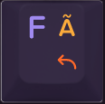

# maxtend User Documentation

## Overview


*Maxtend* is designed to minimise hand movements and enable keyboard operations mostly from the home row hand positions. It is optimised for 60% keyboards (no number pad, no navigation cluster, no function row), but works equally well on TKL[^tkl] or full-size keyboards. *Maxtend* uses layers for the functionality traditionally bound to specific keys (cursor navigation, editing, number entry, function keys etc.), which are not present on a 60% keyboard.

- A short press and release of CapsLock (labelled `Maxtend`) will work as Backspace, as in original Colemak.
- Holding CapsLock (`Maxtend`) together with other keys works as an additional function layer, and contains useful navigation functions, e.g. cursor movement.
- Holding Tab (`Numtab`) enables a virtual number pad, allowing easy number entry.

On a UHK[^uhk], additional functionality is available, e.g. mouse control, 2-axis scrolling, mouse jitter keep-alive, media and volume control.

### Base layer

A maxtended keyboard features a base layer in [Colemak](https://colemak.com/) layout.

```
Colemak base layer:
`~   1!   2@   3#   4$   5%   6^   7&   8*   9(   0)   -_   =+  Bkspc
(Tab)  q    w    f    p    g    j    l    u    y    ;:   [{   ]}   \|
(Mxtnd) a    r    s    t    d    h    n    e    i    o    '"   Return
Shift     z    x    c    v    b    k    m    ,<   .>   /?       Shift
```

On our sample keyboard images, the base layer alphabetic keys are labelled on the top left of the keys. Here is an image of the 'F' key:



An unshifted press of `F` produces a lower-case **f**. A shifted press of `Shift`+`F` produces an upper-case **F**.

On the number row, the base layer is labelled on the bottom left for unshifted symbols (numbers), and on the top left for shifted symbols. Here is an image of the `1!` key:


An unshifted press of `1` produces the number **1**. A shifted press of `Shift`+`1` produces the exclamation mark **!** .

For some symbol keys, the unshifted base layer is also labelled on the bottom left, and the top left shows the shifted base layer symbol. Here is an image of the `;:` key:


An unshifted press of `;:` produces the semicolon **;** , and a shifted press of `Shift`+`;:` produces the colon **:** .

The base [Colemak](https://colemak.com/) layout has a number of alphabet characters on different keys than the well-known US-QWERTY layout, but all the special characters (symbols, punctuation, brackets, parenthesis etc.) are on the same positions as US-QWERTY. In addition, it features a comprehensive set of [international multilingual characters](https://colemak.com/Multilingual) (for latin alphabets) through use of the `AltGr` (right alt) key.


As in standard Colemak, the `CapsLock` key is used as Backspace. It is labeled `Maxtend`. A simple tap on `Maxtend` will produce a backspace, erasing the character to the left of the cursor. See below for layer switching when `Maxtend` is held down.


#### Layer switching

The base layer has three layer-switching keys. When held down and pressed together with other keys, they will activate other layers:
- holding `Maxtend` (Mxtnd) will activate the Maxtend layer
- holding `NumTab` (Tab) will activate the Number layer
- holding `AltGr` (right Alt) will activate the AltGr layer

_Note:_ `AltGr` comes with the Colemak keymap (configured in the OS keyboard layout). `Maxtend` and `NumTab` are enabled through the AHK, keyd, xkb or UHK configuration.

### AltGr layer

```
Colemak AltGr layer:
(~)  ¡¹   º²   ª³   ¢£   €¥   ħĦ   ðÐ   þÞ   ‘“   ’”   – —  ×÷  Bkspc
(Tab)  äÄ   åÅ   ãà   øØ   (˛)  đĐ   łŁ   úÚ   üÜ   öÖ   «‹   »›   ~~
(Mxtnd) áÁ   (`)  ßẞ   (´)  (¨)  (ˇ)  ñÑ   éÉ   íÍ   óÓ   '"   Return
Shift     æÆ   (^)  çÇ   œŒ   (˘)  (°)  (¯)  (¸)  (˙)  ¿~       Shift
```

Note: the AltGr layer contains several dead keys[^deadkey], indicated by parentheses, e.g. `(˘)`:
- `AltGr`+`~` is ~ – to produce ã ẽ õ ñ etc.
- `AltGr`+`r` is ` – to produce à è ò etc.
- `AltGr`+`t` is ´ – to produce á é ó etc.
- `AltGr`+`d` is ¨ – to produce ä ö ü ÿ etc.
- `AltGr`+`h` is ˇ – to produce ǎ ǔ č ť š ř etc.
- `AltGr`+`x` is ^ – to produce ĉ â û ŷ etc.
- `AltGr`+`b` is ˘ – to produce ă ŭ ĕ etc.
- `AltGr`+`k` is ˚ – to produce å ů ẙ etc.
- `AltGr`+`m` is ¯ – to produce ā ō ū ȳ ḡ etc.
- `AltGr`+`,` is ¸ – to produce ç ş ţ ģ ļ ŗ ḑ ḩ ņ ȩ ķ etc.
- `AltGr`+`\` is * – to produce ¶ ™ © ® № µ etc. (_Windows only_)

[^deadkey]: A dead key does not immediately produce a character (“it’s dead”), but it will modify the next character. The accent symbol on the dead key "combines" with the symbol on the next key to produce an accented character. If you want the "dead" symbol on its own, you need to press the dead key first, then type Space.

On our sample keyboard images, the AltGr symbols are labelled on the top right of the keys, and in the same yellow colour as the `AltGr` key. Here is an image of the 'FÃ' key:


When pressed together with `AltGr`+`FÃ`, it produces a lower-case **ã**. When pressed with `AltGr`+`Shift`+`FÃ`, it produces an upper-case **Ã**.


### Maxtend layer

When the `Maxtend` key is held down, the Maxtend layer is activated. The main purpose of this layer is cursor and document navigation, and editing.

```
Maxtend layer:
Esc  F1   F2   F3   F4   F5   F6   F7   F8   F9   F10  F11  F12  Delete
Num   Esc  WhUp Back Fwd  -    PgUp Home Up   End  Del  PrSc ScLk Pause
       Alt  WhDn Shft Ctrl -    PgDn Left Down Rght Bksp Ins     Return
Shift    C-z  C-x  C-c  C-v  b    k    m    ,<   .>   Menu        Shift
```

This layer features useful navigation functions such as:
- cursor navigation (up/down/left/right, home/end, page up/down)
- insert/backspace/delete
- back/forward browser navigation
- escape
- undo/cut/copy/paste
- scroll up/down

On the top (number) row, you can reach Escape (`Maxtend`+`` `~ ``) and the function keys F1-F12 (`Maxtend`+`1` ...  `Maxtend`+`=`). `Maxtend`+`Backspace` becomes Delete.


__Escape:__ It is difficult to press `Maxtend` and the top left `` `~ `` key at the same time. Most likely you have to move the left hand out of the home position. Therefore, Escape can also be found on `Maxtend`+`q` (reached using the pinky+ring fingers of the left hand.

__Navigation:__ Directly in the home row position for your right hand you find cursor up/down/left/right. Other navigation and editing controls (home, end, backspace, delete, insert, page up, page down) are placed closely around this position.

|   |   |   |   |   |
| --- | --- | --- | --- | --- |
|  `6`  |  `7`  |  `8`  |  `9`  |  `0` |
| `j` pageup | `l` home | `u` up | `y` end | `;` delete |
| `h` pagedn | `n` left | `e` down | `i` right | `o` backspace |
| `k` | `m` | `,<` | `.>` | `/?` |

(keys labelled according to Colemak)

*Note:* Although Backspace is already the primary function of the `Maxtend` key, its function is duplicated on this layer. There are two reasons:

  1. While holding the `Maxtend` key and using cursor navigation, removal of incorrect characters is instantly available without needing to release `Maxtend`. And you can immediately continue to navigate.
  2. Backspace through a tap on the `Maxtend` key does not autorepeat (due to secondary function as the Maxtend layer switch). Backspace on the Maxtend layer auto-repeats, and can thus be used to Backspace over larger areas of text.

__Modifiers:__ During cusor navigation, shift, alt and control modifiers are often used to select larger parts of text, navigate by word, sentence, paragraph etc. It is difficult to reach the standard modifier keys while holding `Maxtend` with your pinky. For this reason, the modifiers are replicated on the home row for your left hand, next to the `Maxtend` key. To aid memorisation, the modifiers correspond to Colemak letters: `a`=Alt, `s`=Shift, `t`=conTrol.

For example, you can hold `Maxtend` + `t` (conTrol), and then use left/right cursor functions of the right hand to navigate by word. Similarily, `Maxtend` + `s` (Shift) + `t` (conTrol) + cursor navigation can be used to select by word, etc. The modifiers are all on the left hand, so while you are holding some chords for layer switch and modifiers with your left hand, your right hand is free to tap all the navigation keys. After a short practice, this feels very natural.

__Undo/Cut/Copy/Paste:__ these often used text editing functions are available on their usual Z/X/C/V positions. `Maxtend` + `z`/`x`/`c`/`v` is the same as `Control` + `z`/`x`/`c`/`v`. The idea is that during typical editing, every needed function (movement, selection, cut/copy/paste, undo) can be accessed from the same layer, all while simply holding down `Maxtend`.

__Scrolling:__ to move the document up/down during editing, mouse wheel up/down (to scroll the page) can be accessed with the left hand. This helps when navigating or reading a document.

__Enter:__ when the right hand is resting on the mouse, Enter can be obtained with only the left hand using `Maxtend' + Space.

__PrScr/ScrLk/Pause:__ these are available on the `[{`, `]}` and  `\|` keys. 
Mnemonic: the F-row continues to those buttons.

__Menu:__ on the right side, the `/?` key activates the menu function. With `Maxtend` held down, the user immediately has access to cursor movement to select an entry in the menu.

__Browser navigation:__ `Maxtend`+`F` and `Maxtend`+`P` (qwerty positions: E, R) move backward and forward through browser history (they send Alt-CursorLeft and Alt-CursorRight keys). Compare this to the Mouse layer where these buttons cycle backward and forward through tabs.

**TODO** (continue here)

*Note:* As soon as a second key has been pressed while `Maxtend` is held down, or when `Maxtend` has been held down for more than half a second, releasing `Maxtend` will not Backspace. In this case, an indication will remind the user that Backspace will not be triggered. On AHK configurations, the screen will flash briefly. On UHK keyboards, the segment display will show **`MAX`** (and the _`mod`_ indicator will turn on), indicating that the Maxtend layer has become active. The user can then safely release `Maxtend` without triggering any action.

### Number layer

When the `NumTab` key (tab) is held down, the Number layer is activated. The main purpose of this layer is number entry via a simulated number pad.

```
Number layer:
Esc  ˙    ˙    ˙    ˙    ˙    ˙    7    8    9    0    -_   =+     Bkspc
Num    Esc  ˙    ¡    ¿    ˙    /    4    5    6    –    [{   ]}   \|
(Mxtnd) Alt  ˙    Shft Ctrl ˙    *    1    2    3    +    '"      Return
Shift     C-z  C-x  C-c  C-v  NumLk ˙   0    ,<   .    Enter       Shift
```
(a single ˙ indicates a key with no function)

Pressing `Maxtend`+`NumTab` or holding `Shift`+`NumTab` for a little while locks the number layer. Use the same combination to unlock. While the number layer is locked, you can use `Maxtend` to activate keys from the Maxtend layer; it will revert back to the (locked) number layer when you release `Maxtend`.


```
;
; Number layer (CapsLock+Tab held):
; ESC  WlUp Back Fwd  g    PgUp 4    5    6    Del
;  Ctrl WlDn Shft Alt  d    PgDn 1    2    3    BkSp Ins
;   C-Z  C-X  C-C  C-V  b    k    0    ,    .    /
;
; Number layer (ScrollLock on):
; q    w    f    p    g    j    4    5    6    ;
;  a    r    s    t    d    h    1    2    3    o
;   z    x    c    v    b    k    0    ,    .    /
; 
;
; Number layer - additional mappings (for TKL keyboards):
; PrSc ScLk Paus   =>   7    8    9
; Ins  Home PgUp   =>   4    5    6
; Del  End  PgDn   =>   1    2    3
;      Up          =>        -
; Left Down Right  =>   0    ,    .

```

## UHK functionality

The following features are only available with the external Ultimate Hacking Keyboard.

### General
The base layer contains a normal US keymap (mapped to Colemak by the OS keymap). As standard in Colemak, the CapsLock key functions as Backspace; it carries `Maxtend` as a secondary function. The left space bar switches to the Mouse layer when held down; it still functions as Space when tapped on its own.

I deliberately kept the primary functions of `Maxtend` (Backspace), `Numtab` (Tab) and the left space bar (Space), and switch layers only as a secondary function (when these buttons are held down and combined with other keys). The usual primary function of these keys is unmodified.

The right Space bar is kept without any secondary function because the secondary function can conflict with n-key rollover when typing fast, and I noticed that I mostly type space with my right thumb. If that is different for you, and you mainly type Space with your left thumb, you may want to move the secondary Mouse layer switch (*Mousetend* macro) from the left Space to the right Space.

### Mouse layer
Holding left Space activates the Mouse layer. The UHK display will briefly show **`MSE`**, and the _`mouse`_ indicator will turn on.

The left case key functions as a left mouse button. This is useful if you do not have a key cluster module connected (which has mouse buttons), but a mouse module (e.g. trackpad) on the right side. You can use the left case button to click items while steering the mouse pointer with the right module.

### Media layer
Holding either Fn key activates the Media layer. This offers features to control media playback, volume control, speaker and mic mute, as well as some compatibility with the Colemak AltGr layer.

### Mirror layer

### Additional features
CapsLock on ISO: On the UHK, the ISO key can be used to send an actual CapsLock. However, with the AHK script in place, this will just trigger the FUNCTION layer on AHK. The net effect is that it is the same as just using Mod (CapsLock). (It can be used to test the AHK script, though, without the UHK layer interfering.)

For cursor control using only the right hand, Mod (the Maxtend layer) is also available on the right case button, and it's a secondary function on the `'"` key. The layer can also be locked on the UHK by double-tapping the right case button.

#### Keepalive

#### Numpad Enter (wide Enter)
Numpad Enter is mapped onto the right `Control` key; it still acts as RCtrl as a secondary function. Here is my reasoning:
- `Control` only makes sense as a modifier and needs to be typed together with another key.
- If you really need only a tap on `Control`, you can use the left `Control`.
- the size of the right `Control` key on the UHK is identical to a standard US-keyboard `Return` key. I swapped the keycaps on my UHK, and to populate the right `Control` position, I usually install an `Enter` key there. Because it is labelled “Enter”, it makes only sense that it also functions as Enter when the user taps it.


(This is only on the UHK. The AHK script does not modify right Control.)

-----
[^tkl]: Ten-Key-Less. A keyboard that does not have a "number pad" key cluster for number entry.

[^uhk]: [Ultimate Hacking Keyboard](https://www.ultimatehackingkeyboard.com), an external, split USB keyboard with optional extra modules. The UHK offers advanced key configuration, layers, programming capabilities via a macro programming language, and mouse control.
