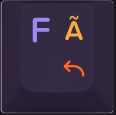
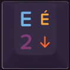
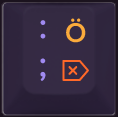
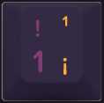
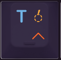
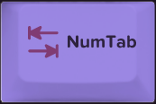

# Maxtend Keycaps Layout

_(Work in Progress)_

## Overview

A set of keycaps have been designed to visualise the layers and functions of **Maxtend**.

### Key legends

Key legends are placed on four quadrants of the key, and their functions are hinted by colour.

#### Colours

Each row of the layout has a different main symbol colour. This colour can be seen on the main symbol on the top left quadrant on each key. The outside (leftmost, rightmost) keys on each row are special and have their colours reversed; on these keys, the background colour is the main symbol colour of that row.

All of the modifiers on the bottom row (Ctrl, Port, Alt, Fn, AltGr, Cake, and Control) also have reversed colours.

In addition to the main symbol colour, which is used only on the left side of the key, and which changes from line to line, three more colours are used:

1. **Numbers**: shown in _Purple_ (Pantone 2612C); _Number_ layer, activated by `NumTab`. Same colour as the symbol on the `NumTab` key. Also, normal function for keys in the number row. Only used on the left side of the key.
2. **Maxtend**: shown in _Orange_ (Pantone 1505U): _Maxtend_ layer, activated by `Maxtend`. Same colour as the symbol on the `Maxtend` key. Only used on the right side of the key when representing _Maxtend_ functions.
3. **AltGr**: shown in _Yellow_ (Pantone 7549U): _AltGr_ layer, activated by `AltGr`. Same colour as the background colour of the `AltGr` key. Only used on the right side of the key when representing _AltGr_ symbols.

#### Quadrants

For all keys that produce characters, up to four legends are printed in the four quadrants.

##### Top left corner

This is the character produced when the key is typed together with `Shift`. For alphabet keys, it is the upper-case version of this key's letter. For number keys and symbol keys, it is the "upper" (shifted) symbol, e.g. **!** for the `1!` key, and **\{** for the `[{` key.

##### Bottom left corner

This is the character produced when the key is typed without modifiers. For alphabet keys, this quadrant is not used. (It is left empty or shows a purple number.) Alphabet keys will produce the lower-case version of the letter shown in the top left quadrant.

For number keys and symbol keys, it is the "lower" (unshifted) symbol, e.g. **1** for the `1!` key, and **\[** for the `[{` key.

Alphabet keys with a _purple_ number in this quadrant indicate the number produced on the _Number_ layer. These keys are only found on the right-hand side of the keyboard. For example, **2** will be produced by `NumTab`+`E`.

##### Top right corner

Shown in _yellow_, this is the symbol produced on the _AltGr_ layer.

For letter symbols, the upper-case version is produced when the key is typed together with `AltGr`+`Shift`+_key_ and the corresponding lower-case version can be produced with `AltGr`+_key_. For example, `AltGr`+`N` will produce **ñ**, and `AltGr`+`Shift`+`N` will produce **Ñ**.

Dead keys are indicated by a dashed circle (a symbolic placeholder for the letter that will be accented) and an accent mark above or below. For these keys, the dead key is activated with `AltGr`+_key_ (do not use `Shift`), and then followed by whatever letter shall be converted into the accented version. For example, `AltGr`+`H` (**ˇ**) followed by `C` will produce **č**.

_Note:_ the dashed circle representing the dead key placeholder is also printed on the `AltGr` key as a reminder for this functionality.

##### Bottom right corner

Shown in _orange_, this is the _Maxtend_ function for this key. For example, `Maxtend`+`U` will move the cursor up, and `Maxtend`+`E` will move the cursor down.

_Note:_ `Maxtend`+`A`/`S`/`T` activate the Alt/Shift/conTrol modifiers, and their _orange_ symbols match the symbols printed on the Alt, Shift, and Control keys in the bottom row.

Shown in _yellow_, this is the unshifted symbol produced on the _AltGr_ layer (only found in the number row).

### Base layer

#### Alphabet keys

Alphabetic keys are labelled on the top left of the keys with the upper-case version of the letter. Here is an image of the `F` key:

| key | base | `AltGr` | `Maxtend` | `NumTab` |
| --- | --- | --- | --- | --- |
|  | `Shift`: letter F  letter f | `AltGr`+`Shift`: letter à   `AltGr`: letter ã | Back (Browser) | |

Typing `F` without modifiers produces a lower-case **f** , and typing `Shift`+`F` produces an upper-case **F** .

##### Alphabet keys with number pad

Some of the alphabetic keys are also part of the numbers layer. On these keys, the lower left shows their respective keypad number in the same colour as the numbers on the number row. Here is an image of the `E` key:

| key | base | `AltGr` | `Maxtend` | `NumTab` |
| --- | --- | --- | --- | --- |
|  | `Shift`: letter E  letter e | `AltGr`+`Shift`: letter É   `AltGr`: letter é | Down (Cursor) | number 2|

#### Symbol keys

The main symbol keys carry two different symbols. The unshifted base layer symbol is shown on the bottom left, and the shifted symbol on the top left. Here is an image of the `;:` key:

| key | base | `AltGr` | `Maxtend` | `NumTab` |
| --- | --- | --- | --- | --- |
|  | `Shift`: symbol :  symbol ; | `AltGr`+`Shift`: letter Ö   `AltGr`: letter ö | Delete | numpad – |

Typing `;:` produces the semicolon **;** , and  `Shift`+`;:` produces the colon **:** .

#### Number keys

On the number row, the bottom left shows the unshifted symbols (numbers), with the shifted symbol on the top left. Here is an image of the `1!` key:

| key | base | `AltGr` | `Maxtend` | `NumTab` |
| --- | --- | --- | --- | --- |
|  | `Shift`: symbol !  number 1 | `AltGr`+`Shift`: symbol ¹   `AltGr`: symbol ¡ | function key F1 | numpad 1 |

Typing `1` produces the number **1**, whereas `Shift`+`1` produces the exclamation mark **!** .

### Maxtend layer

The functionality of the _Maxtend_ layer is shown in orange colour on the bottom right side of the key. The `Maxtend` key also features an orange star symbol to hint at the corresponding symbol colour.

| key | `Maxtend` function |
| --- | --- |
|  | The `T` key works as Control when activated as `Maxtend`+`t` |

### AltGr layer

The functionality of the _AltGr_ layer is shown in yellow colour on the right side of the key. In the number row, both shifted and unshifted versions are shown on the top and bottom right side. On alphabet keys, only the shifted version (the uppercase symbol) is shown on the top right. The unshifted version is then equivalent to the lowercase symbol.

<!--
Smaller images, but not really endorsed for proper markdown (lint will complain):

-->

The AltGr symbols are labelled on the top right of the keys in the same yellow colour as the `AltGr` key. Here is an image of the 'FÃ' key:

When pressed together with `AltGr`+`FÃ`, it produces a lower-case **ã**. When pressed with `AltGr`+`Shift`+`FÃ`, it produces an upper-case **Ã**.

### Number layer

Holding down *NumTab* activates the number layer. The numbers for this layer are shown on the bottom left side of the key in the same colour as the numbers in the number row. Here is an image of the `EÉ` key:

When pressed together with `NumTab`+`EÉ`, it produces the number **1**.
