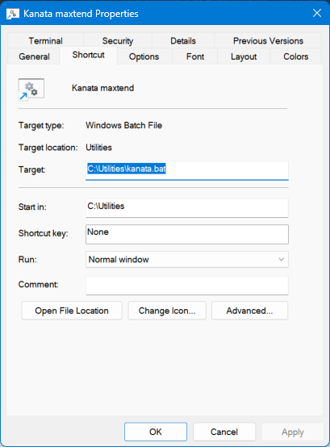

# HOWTO install as a service (Linux)

1. Install kanata.
2. Copy the configuration file to a system wide place. (We use `/etc/kanata`.)
2. Install the service description for kanata.
3. (re)start the system service.
4. Enable it to auto-start on boot.

```
mkdir /etc/kanata
cp colemax-maxtend.kbd /etc/kanata
sudo install -m 644 kanata.service /lib/systemd/system/kanata.service
# maybe the next line will be required after installing or changing the service file:
# sudo systemctl daemon-reload 
sudo systemctl start kanata
sudo systemctl enable kanata
```

# HOWTO install to autostart (Windows)

1. Create an installation directory. We use `C:\Utilities`.
2. Download `kanata_winIOv2.exe` and move it to `C:\Utilities`.
3. Copy the configuration file to `C:\Utilities\colemax-maxtend.kbd`.
4. Copy `kanata.bat` to `C:\Utilities`.
5. Press `Win`+`R`, enter `shell:startup` and click `OK`.
6. Create a shortcut to `C:\Utilities\kanata.bat` in this folder.



When you login to your user account, Kanata will be run in a small terminal window. You will be able to monitor layer changes in this window.

To test your setup & start Kanata immediately, double-click the shortcut.
